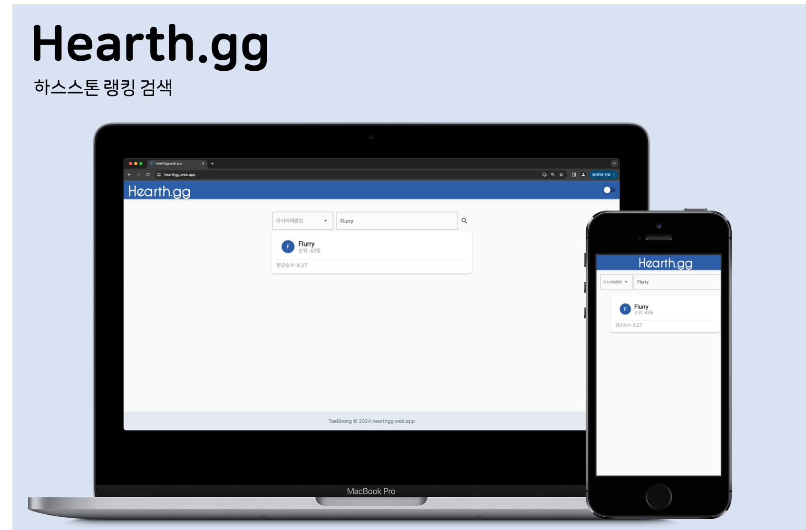

# 🏆 하스스톤 랭킹 검색 사이트 hearthgg 🏆

> 하스스톤 투기장, 정규전 랭킹 검색 웹 서비스

## :rocket: 프로젝트 설명

- 블리자드에서 일부만 공개하던 랭킹 데이터를 모든 유저에 대해 공개하였습니다.
- 하지만 검색 기능이 없어 본인 아이디를 찾으려면 직접 페이지를 넘기며 탐색해야 했습니다.
- 이에 데이터 미러 서버를 구축해놓고 간편히 검색할 수 있는 기능을 웹 서비스로 구현하였습니다.

## 💻 기술 스택

## 🛠 업데이트 로그

### [1.0.1]() - 2024-06-01 

#### Released

- 로고, 일부 UI를 변경하여 배포하였습니다.

#### Changed

- ThemeData를 활용하여 스타일을 적용하였습니다.
- GetX, MVVM 패턴을 적용하여 코드를 개선시켰습니다.

### [1.0.0]() - 2024-05-09

#### Released

- 초기 프로덕트를 개발하여 단순 검색 기능만 구현, 배포하였습니다.
- 투기장 검색만 지원합니다.

## 📖 개발 기록

- [하스스톤 랭킹 검색 사이트 개발기](https://taebbong.github.io/)